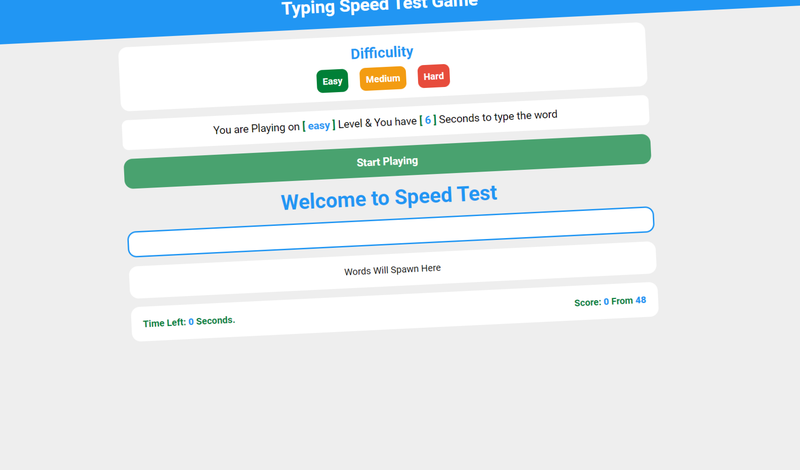

# Games Repo 🎮

Welcome to the **Games Repo**! This repository serves as a collection of my game projects. Below you'll find links to live previews, repositories, and animated previews for each game. Get ready to play and explore the code behind these exciting games!

## Overview 🕹️

This repository highlights my game development projects. These games demonstrate various aspects of gameplay mechanics, UI design, and state management, with dynamic animations and fun user experiences.

## Games 🚀

### 1. [Xo-Game](https://ahmedkamal14.github.io/XO-Game/) ❌⭕
A classic Tic-Tac-Toe game built with **React**, featuring smooth animations and real-time score tracking. Play against a friend and keep track of your wins, losses, and draws.

- **[Live Preview](https://ahmedkamal14.github.io/XO-Game/)**
- **[Repository](https://github.com/ahmedkamal14/XO-Game)**

---

### 2. [Typing Speed Game](https://ahmedkamal14.github.io/Typing-Speed-Game/) ⌨️⚡
Test your typing speed and accuracy with this **Typing Speed Game**! Built with **JavaScript** and **React**, it tracks the time taken to type random sentences, displays your speed in words per minute (WPM), and includes a leaderboard for high scores.

- **[Live Preview](https://ahmedkamal14.github.io/Typing-Speed-Game/)**
- **[Repository](https://github.com/ahmedkamal14/Typing-Speed-Game)**

---

## Features 🌟

- **Engaging UI**: Enjoy interactive user interfaces with smooth animations. 🖥️
- **Real-time Gameplay**: Track scores, game state, and typing speed in real-time. ⏲️
- **State Management**: Built using React hooks like `useState` and `useEffect`. 🎯
- **Responsive Design**: Fully responsive and accessible across devices. 📱💻

## Technologies Used 💻

Here’s a list of the technologies used to build these games:

- **React** 
- **Vite** 
- **JavaScript** 
- **Tailwind CSS** 
- **CSS** 
- **HTML5** 

## Libraries & Tools 🛠️

- **React Icons** 
- **JS Cookies** 

## Getting Started 🏁

To play these games, click on the **Live Preview** links to experience them directly in your browser, or check out the **Repository** links to dive into the code.

---

Enjoy the games! Feel free to contribute, report issues, or fork any of the repositories.

---

## License 📜

This project is licensed under the [MIT License](https://opensource.org/licenses/MIT). See the [LICENSE](LICENSE) file for more details.

---

### ✨ Have fun and happy coding! 👾
